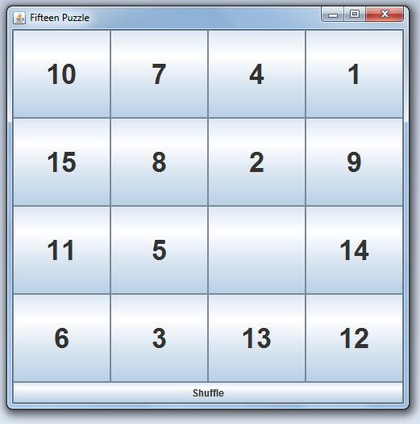
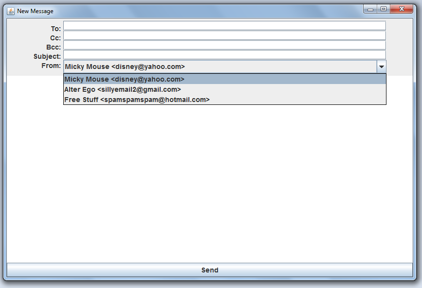
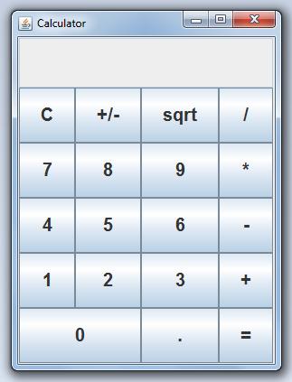
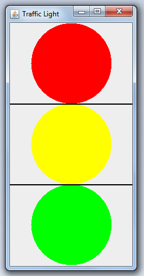
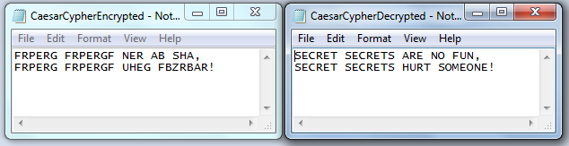

# CSCI E10-b
This course was the second part of one of my favorite courses while getting my Masters through the Harvard Extension School. This repo is a subset of my solutions to my favorite projects ordered by favorite. Course was completed through a cloud-based Linux environment with an emphasis was on object-oriented programming using Java. Conetent included classes (abstract data, encapsulation, inheritance hierarchies, and polymorphism), String processing, multidimensional arrays, lists, file I/O, recursion, exception handling, event-driven programming, and GUI design using Swing.

## Project 1: FifteenPuzzle
This program creates a basic version of a fifteen puzzle with numbers (rather than creating a whole picture). The objective is to get the numbers 1-15 organized from left to right/top to bottom. There is a shuffle button included that creates an authentic shuffle (as opposed to randomly placing numbers on the board which can lead to unsolvable games).

## Project 2: MailLayout
This program creates a look-alike to an email message. It outputs the file to a file called "Outbox.txt"

## Project 3: Calculator
This program creates a simple four function calculator, similar to the generic Windows calculator. It uses a GridBagLayout to arrange the buttons and includes a +/- button to toggle positives and negatives. It prevents the user from entering two decimals at once. The calculator's display reduces all doubles to no more than 10 digits past the decimal point.

## Project 4: LinkedDequeue
This class represents a Dequeue ("double-ended queue) datatype implemented using a singly-linked list with addable and removable parts at the head and tail of the queue.

## Project 5: ExamAnalysis
This program quickly scores and analyzes a multiple choice test. The program takes a user-typed answer key and asks for the file location of the multiple choice exams. It then scores the test and provides a question by question report of the results.

## Project 6: TrafficLight
This program creates a responsive traffic light look-alike which grows and shrinks as the  window changes. The stoplight is always centered.

## Project 7: CaesarCipher
This program can encrypt or decrypt a Caesar Cipher by shifting the capital letters up or down in the alphabet. The program then outputs the result to a new file that the user chooses. Possible future update: automatically determine what the decrypt shift needs to be in order to create English words by cross referencing the output with an English word list!

## Project 8: Ship
This program is an abstract class for creating objects of type ship. Ships have a name, a year built, and an EngineType.
